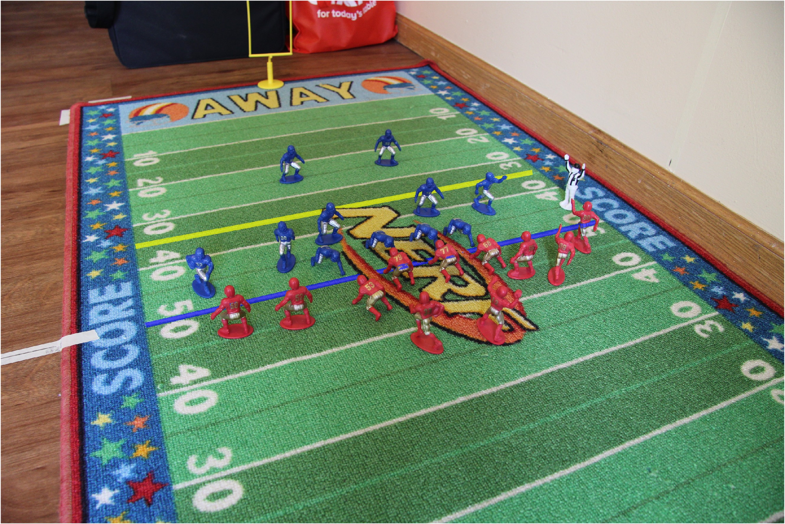
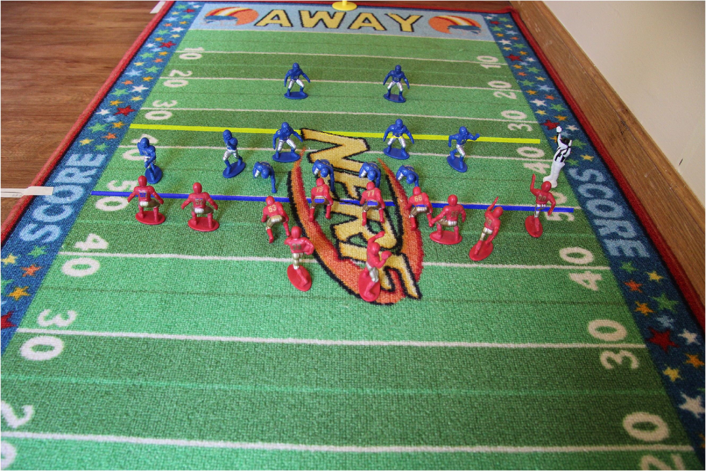
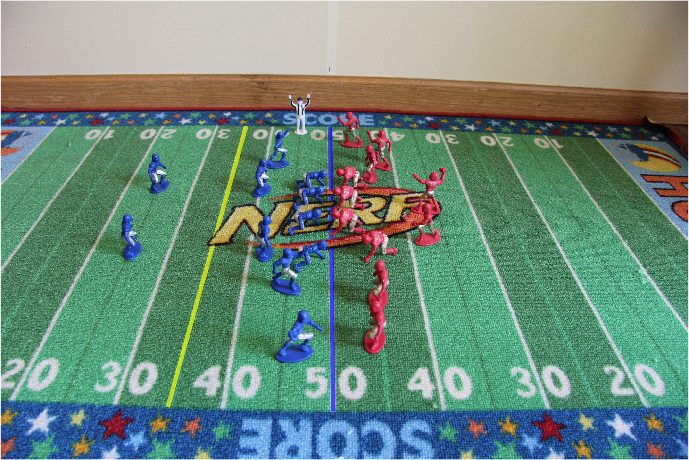

# Football Line Projection Project

## Summary
This project is for overlaying a line of scrimmage (blue) and first down line (yellow) onto an image of a football field. 

Users enter the cameras intrinsic values (obtained with matlab camera calibration), an image of a football field, real world to image space reference points, and the desired yard lines for line of scrimmage and first down line. 

The result is a perspective-correct image with yard lines automatically projected onto the field. To improve realism, a color-based mask is also applied to the image. This ensures objects and players to occlude the projected lines.

